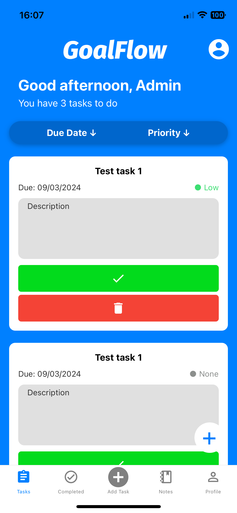
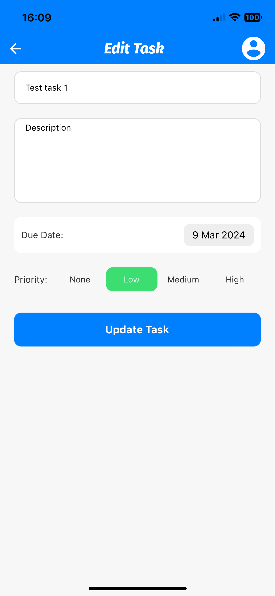
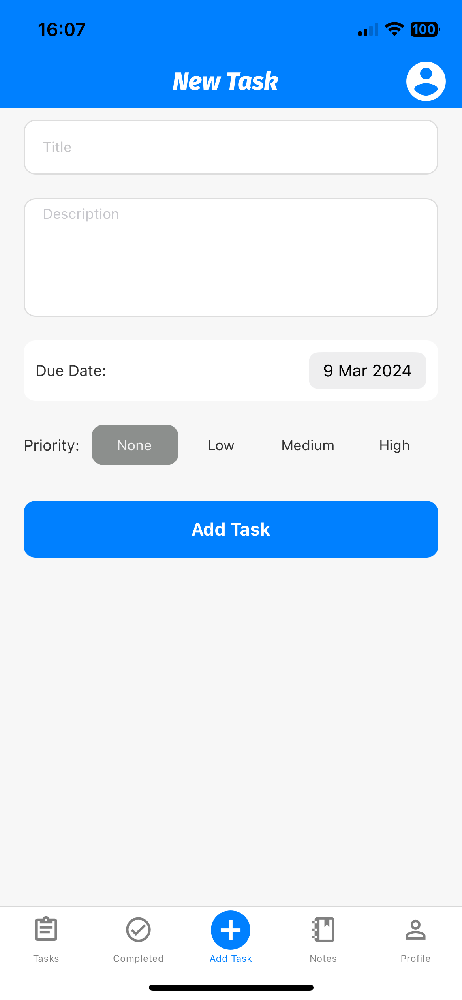
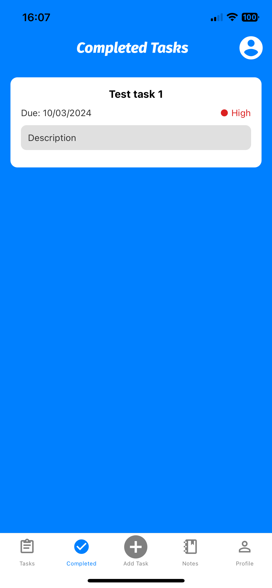
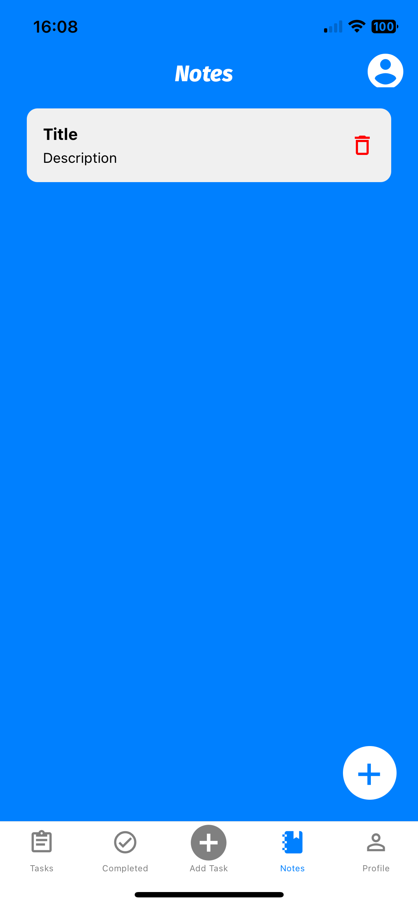
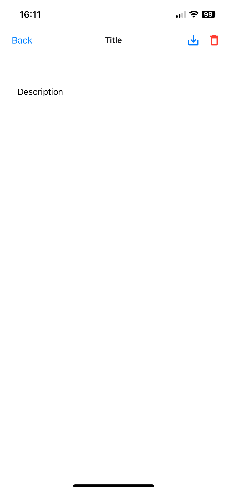
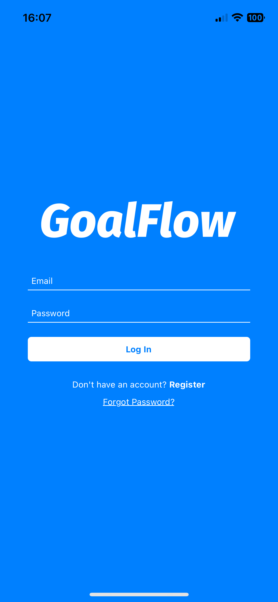
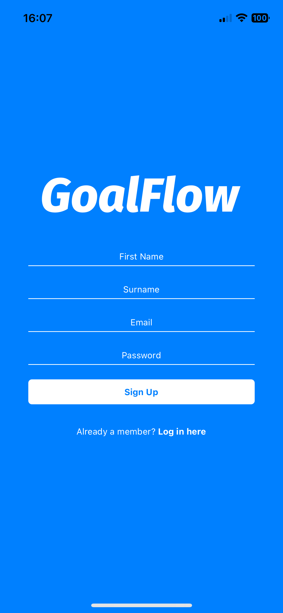
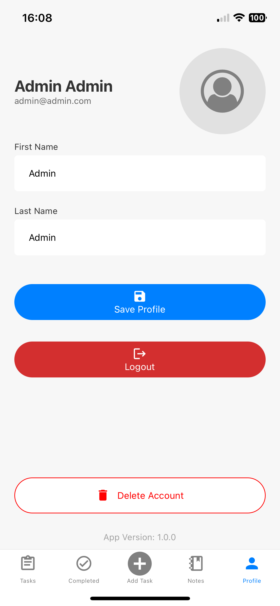

# GoalFlow

## React Native Task Manager Application

### GoalFlow is a Task Management Application developed with React Native, Expo and Firebase. 

The main functionality of GoalFlow allows users to create, read, update and delete tasks and notes in the application. It makes use of Firebase and AsyncStorage for database functionality. 

## Main Screens

### Tasks Screen

On the Tasks Screen, users can conveniently view their tasks. This screen also offers features like sorting tasks by due date or priority and options to either delete tasks or mark them as completed.

    

### Edit Task Screen

The Edit Task Screen facilitates easy modification of tasks. Users can adjust task details such as title, content, priority, and due date here.

    

### Add Task Screen

Through the Add Task Screen, users can create new tasks, which are then displayed on the Tasks Screen.

    

### Completed Screen

The Completed Screen is a dedicated space for users to review all their tasks that have been marked as completed, offering a sense of accomplishment and progress tracking.

    

### Notes Screen

The Notes Screen presents a list of all created notes, providing users the option to eliminate any unnecessary notes.

    

### Note Detail Screen

Here, users can focus on individual notes. The screen allows for updating the note's content or deleting it as needed.

    

### Add Note Screen

Users can utilise the Add Note Screen to create and save new notes, which are then stored in the database for future reference.

    

### Login Screen

The Login Screen facilitates access for returning users. It's designed for users with existing GoalFlow accounts to log in and access their personal task and note space.

    

### Register Screen

The Register Screen caters to new users, offering a straightforward registration process to set up a new GoalFlow account.

    

### Profile Screen

As a hub for user management, the Profile Screen provides various functionalities. Users can update their name and profile picture, save profile changes, log out, or even delete their account.

    

